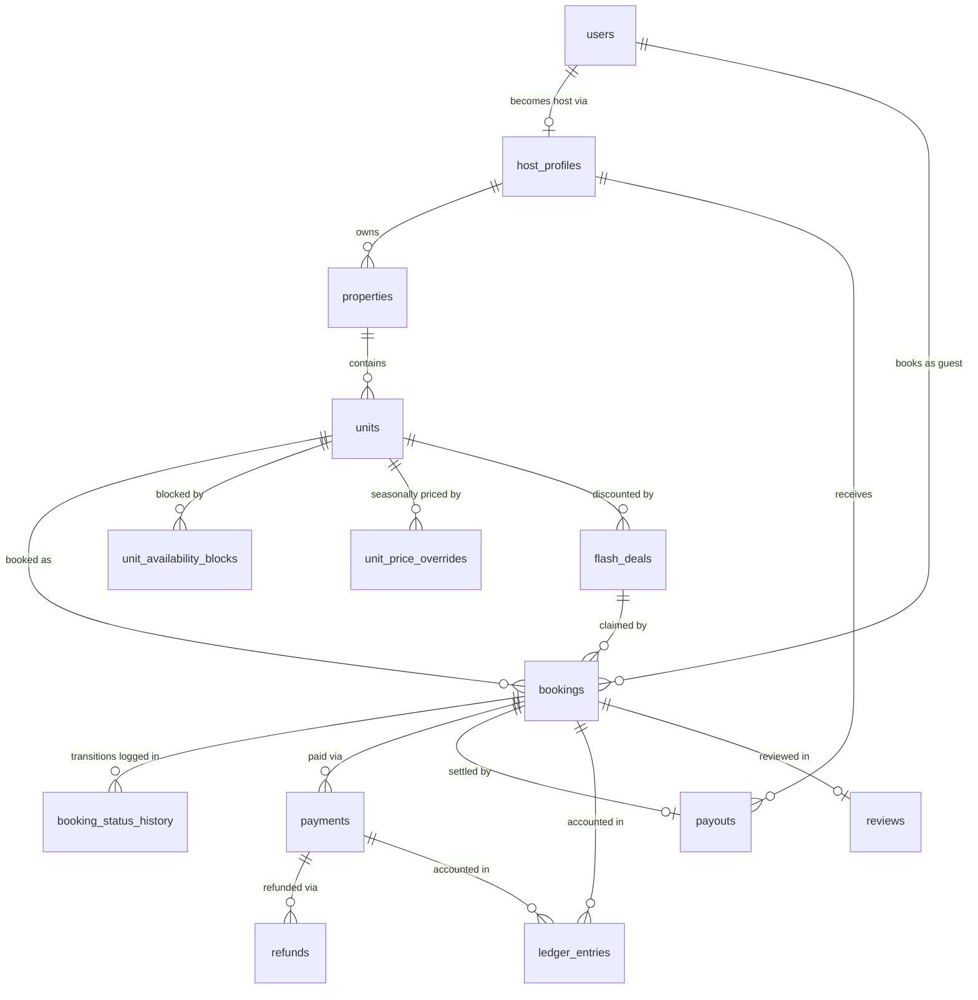

# Last Chance — Database Schema (Phase 1)

PostgreSQL 16 + PostGIS 3.4. Plain-SQL migrations, applied strictly in filename order.
In Phase 2 these are wired into the NestJS migration runner; the SQL files remain the
single source of truth — no ORM-generated DDL, ever.

## Entity-Relationship Diagram



Supporting tables not shown: `platform_settings` (operational config),
`booking_fsm_transitions` (FSM whitelist), `payment_webhook_events` (idempotent
webhook inbox), `audit_log` (global immutable audit trail).

## Migration map

| File | Contents |
|---|---|
| `0001_extensions.sql` | btree_gist, PostGIS, citext, pgcrypto, pg_trgm |
| `0002_enums_domains.sql` | All state enums + domains (`money_minor`, `currency_code`, `percentage`, `phone_e164`) |
| `0003_functions.sql` | `fn_booking_block_range` (immutable buffer-range builder), request-context accessors, shared trigger functions |
| `0004_identity.sql` | `platform_settings`, `users`, `host_profiles` |
| `0005_inventory.sql` | `properties` (PostGIS point), `units`, `unit_availability_blocks`, `unit_price_overrides` |
| `0006_bookings.sql` | `bookings` + **the exclusion constraint**, FSM whitelist + guard triggers, append-only status history, cross-calendar advisory-lock guards, stale-hold sweeper |
| `0007_payments.sql` | `payments`, `refunds`, `payment_webhook_events`, `payouts`, double-entry `ledger_entries` with deferred balance enforcement |
| `0008_flash_deals.sql` | `flash_deals` with per-unit overlap exclusion + atomic claim inventory |
| `0009_reviews.sql` | `reviews` with eligibility guard + denormalized rating aggregates |
| `0010_audit.sql` | `audit_log`, generic row-audit trigger, append-only enforcement |
| `0011_indexes.sql` | Hot-path indexes (partial wherever the working set allows) |
| `0012_security.sql` | `lastchance_app` role: no hard deletes, no history rewrites |
| `0013_mock_provider.sql` | `MOCK` payment provider enum value (dev/test PSP) |
| `0014_auth_roles.sql` | `users.platform_role` for JWT authorization |
| `0015_fsm_money_currency_integrity.sql` | No-show + mid-stay FSM edges, exact split identity, currency composite FKs |

## The seven load-bearing design decisions

1. **Double-booking is impossible at the engine level.** `bookings.block_range` is a
   stored generated `tstzrange` of `[check_in, check_out + turnaround_buffer)`, and a
   partial GIST `EXCLUDE` constraint (`unit_id WITH =, block_range WITH &&`, filtered to
   inventory-holding statuses) means two overlapping bookings for one unit cannot both
   commit. Application code, Redis, and humans can all be wrong; the constraint cannot.

2. **The turnaround buffer is baked into the stored range** and `turnaround_minutes` is
   snapshotted onto each booking. A host changing their buffer never retroactively
   invalidates existing bookings. Half-open `[)` bounds make exact back-to-back stays
   legal (14:30 buffer end + 14:30 check-in = no conflict).

3. **`timestamptz + interval` is only STABLE in Postgres**, so it cannot be used in a
   generated column. `fn_booking_block_range` wraps *minutes-only* addition — which is
   genuinely deterministic — and is declared IMMUTABLE. Do not generalize it to
   day/month intervals; that would be a lie to the planner.

4. **The FSM is data + a trigger, not conventions.** `booking_fsm_transitions`
   whitelists legal transitions; a `BEFORE UPDATE` trigger rejects everything else
   (SQLSTATE `LC400`) and an `AFTER` trigger appends to `booking_status_history`.
   Releasing inventory is always a status flip, never a `DELETE`.

5. **The 10-minute hold is durable.** `PENDING_PAYMENT` + `hold_expires_at` participate
   in the exclusion constraint, so a hold blocks inventory even if Redis and every app
   pod die. `fn_expire_stale_holds()` (BullMQ delayed job + sweeper cron) releases
   lapsed holds idempotently with `FOR UPDATE SKIP LOCKED`.

6. **Cross-table calendar conflicts are serialized with advisory locks.** Same-table
   overlaps are handled by each table's own EXCLUDE constraint; bookings vs host blocks
   are guarded by trigger pairs that first take `pg_advisory_xact_lock` on the unit,
   eliminating the read-committed race between the two tables (SQLSTATE `LC409`).

7. **Escrow is a real double-entry ledger.** Every money movement writes a balanced
   entry group; a DEFERRED constraint trigger makes an unbalanced or mixed-currency
   group unable to commit (`LC422`). `payouts.booking_id` is UNIQUE — a stay can never
   be paid out twice — and webhook idempotency is `UNIQUE (provider, event_id)`.

Also deliberate: **units are quantity-1 resources** (a hotel room type with 20 rooms =
20 unit rows sharing `unit_group_key`) because capacity-counter models cannot give the
exclusion-constraint guarantee. **No card/bank data is ever stored** — provider tokens
only. **All money is integer minor units** (`bigint`), all instants UTC; the property's
IANA timezone is presentation-only.

## Custom SQLSTATE map (API layer translates these)

| SQLSTATE | Meaning | HTTP |
|---|---|---|
| `23P01` | Exclusion violation — unit already booked | 409 `UNIT_UNAVAILABLE` |
| `LC400` | Illegal FSM transition | 409 `INVALID_STATE` |
| `LC401` | Immutable field mutation attempt | 422 |
| `LC402` | Invalid initial booking status | 422 |
| `LC403` | Append-only table mutation | 500 (should never surface) |
| `LC409` | Calendar conflict (booking ↔ host block) | 409 `UNIT_UNAVAILABLE` |
| `LC422` | Unbalanced/mixed-currency ledger group | 500 (invariant breach) |

## Transaction context contract

Every service transaction stamps itself before writing (read by history + audit triggers):

```sql
SET LOCAL app.actor_id   = '<uuid>';
SET LOCAL app.actor_type = 'GUEST';   -- GUEST | HOST | ADMIN | SUPPORT | SYSTEM
SET LOCAL app.request_id = '<trace-id>';
```

## Running locally

```powershell
docker compose up -d          # PostGIS 16 + Redis 7 (from project root)
.\db\run-migrations.ps1       # applies every migration in order, then runs smoke tests
```

The smoke test (`db/tests/smoke_test.sql`) proves every guarantee live — overlap
rejection, buffer enforcement, boundary legality, FSM whitelist, cross-calendar
guards, hold expiry, ledger balance, append-only history, audit capture, review
eligibility — and rolls itself back, leaving the database clean.
